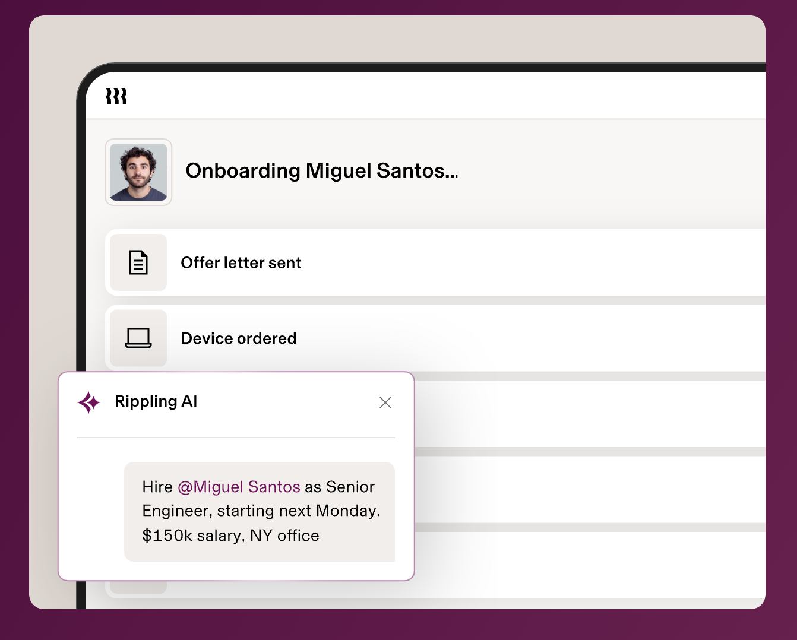
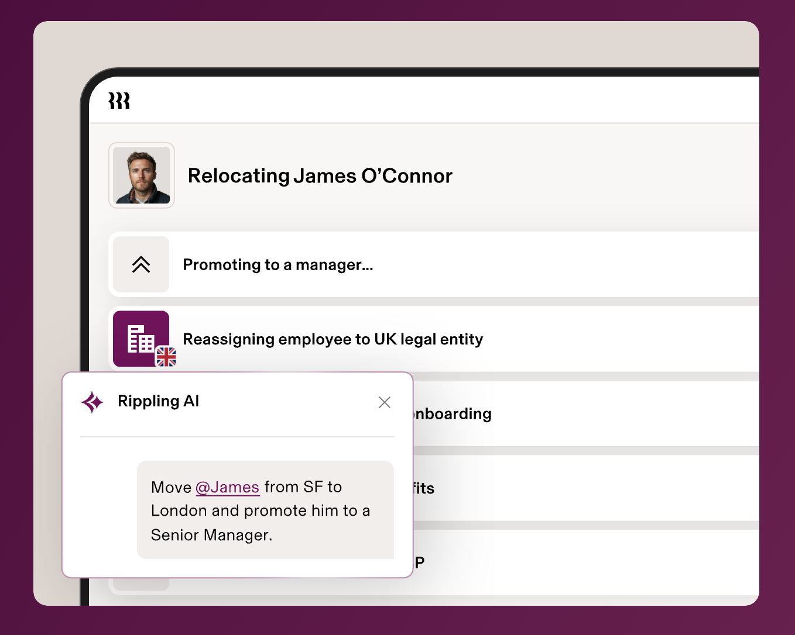
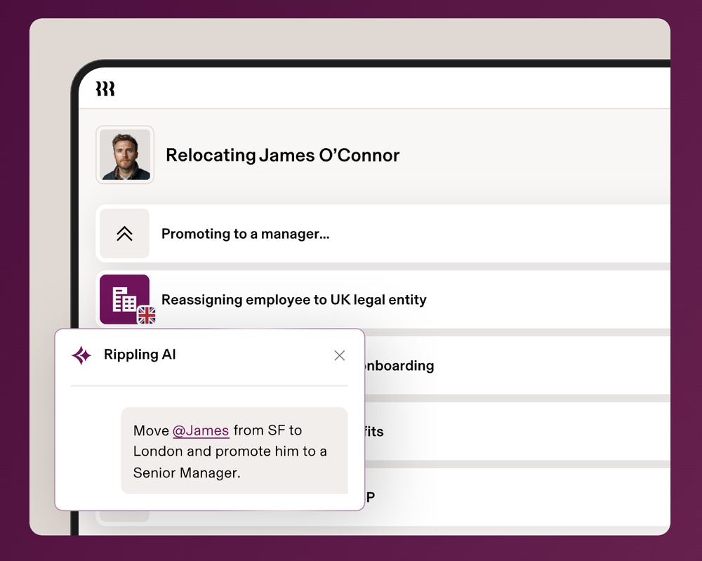

# Rippling

**Learn about Rippling.**

 

### 

[**Visit Rippling on SOFTGIT**](https://softgit.pro/p/rippling) · [Browse apps](https://softgit.pro)

---

## Overview

Learn about Rippling.

Learn about Rippling. Read Rippling reviews from real users, and view pricing and features of the Human Resources software

## At a glance

- Category: Security
- Publisher / site: rippling.com
- Listing tag: Free trial
- Official site (from listing): https://www.rippling.com/lp/hris-6-e
- Source listing: https://sourceforge.net/software/product/Rippling/
- Type: Business / SaaS listing (information page)

## Screenshots

  
  
  
  
  
  

## System / listing information

| Field | Value |
|---|---|
| Name | Rippling |
| Category | Security |
| Publisher | rippling.com |
| Platform | Any |
| License / offer | Free trial |
| Updated | October 6, 2026 |
| Listed package size | 1.1 MB |

## How to get started

1. Open the [Rippling page on SOFTGIT](https://softgit.pro/p/rippling).
2. Review the overview, screenshots, and any official website link on that page.
3. Use the page CTA to visit the vendor site or request access / trial as offered there.
4. This GitHub repo is an informational listing only — it does not host SaaS installers or account credentials.

[**Visit Rippling on SOFTGIT**](https://softgit.pro/p/rippling)

## FAQ

**What is this repository?**  
An unofficial information page for Rippling, with links to the [SOFTGIT listing](https://softgit.pro/p/rippling).

**Is software redistributed here?**  
No. SaaS products are used via the vendor’s website or apps. Do not treat any third-party zip on a listing as the product itself without verifying the source.

**Who owns this product?**  
Third-party software/service, all rights belong to the original authors and trademark owners. This repo is not affiliated with them.

---

[**Visit Rippling**](https://softgit.pro/p/rippling) · [SOFTGIT](https://softgit.pro)

Third-party software/service, all rights belong to the original authors. Unofficial listing for Rippling.

